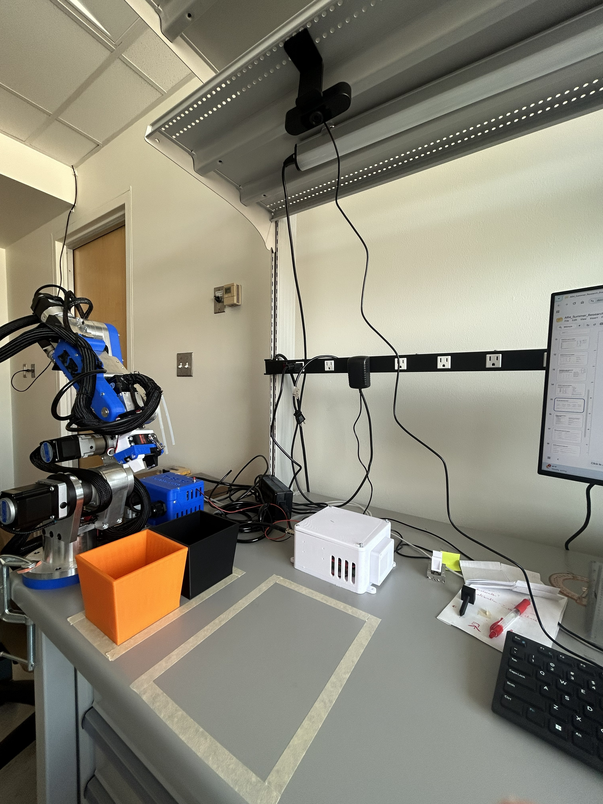

# AR4 Custom Control System

A custom MATLAB/Simulink control stack for the **Annin Robotics AR4 MK3** 6-DOF robotic arm, replacing the manufacturer's firmware. The model is deployed to a **Teensy 4.1** via Embedded Coder and drives the arm through homing, coordinated motion, closed-form inverse kinematics, and vision-guided pick-and-place with colour sorting.

Summer research project, 2026 — Nuris Abdyldaev.

---

## The setup

<p align="center">
  
</p>

<p align="center"><i>The AR4 MK3 arm, overhead webcam, and block workspace.</i></p>

---

## Demos

<p align="center">
  
</p>

<p align="center">
  <b>Vision-guided pick &amp; place.</b> The overhead camera locates a block and the arm sorts it by colour.<br>
  <i>Shown at 2× speed.</i>
</p>

<p align="center">
  <a href="media/pick_up_demo.mp4">▶ Full pick-and-place video</a>
  &nbsp;·&nbsp;
  <a href="media/callibration_demo.mp4">▶ Homing &amp; calibration video</a>
</p>

The homing video shows the staged startup sequence — each joint seeking its limit switch, zeroing its encoder count, and driving to its home angle, two joints at a time.

---

## Architecture

The Simulink model is not one large diagram. It is five MATLAB Function blocks, each with a single responsibility, wired together on the model canvas. All of it compiles to C and runs on the Teensy 4.1 at a **30 µs base rate**.

```
                    ┌─────────────────┐
   overhead cam ───▶│  Vision (host)  │ pixel → mm via homography
                    └────────┬────────┘
                             │ target x,y + colour
                    ┌────────▼────────┐
                    │  pickPlaceFSM   │ approach → grip → place
                    └────────┬────────┘
                             │ Cartesian target
                    ┌────────▼────────┐
                    │    AR4_IK       │ closed-form IK
                    └────────┬────────┘
                             │ six joint angles
        ┌────────────────────┼────────────────────┐
        │                    │                    │
┌───────▼────────┐  ┌────────▼────────┐  ┌────────▼────────┐
│ HomingSequencer│  │    CoordMove    │  │   J1.m – J6.m   │
│  startup only  │  │  one S-curve    │  │ step/dir pulses │
└────────────────┘  └─────────────────┘  └─────────────────┘
                             │
                    ┌────────▼────────┐
                    │   Teensy 4.1    │ ──▶ stepper drivers
                    └────────┬────────┘
                             │ GPIO pin 34
                    ┌────────▼────────┐
                    │  Arduino Nano   │ ──▶ servo gripper
                    └─────────────────┘
```

### Module 1 — Joint controllers (`J1.m` – `J6.m`)

One block per joint, all running the same logic with per-joint constants. Each takes a target angle and raw encoder pins, and emits step and direction pulses. A single `mode` input selects behaviour:

| mode | name | behaviour |
|---|---|---|
| `0` | POSITION | Follow the `positionAngle` input — normal IK-driven operation |
| `1` | INITIALIZE | Ignore the input; drive to this joint's own `HOME_TARGET` |
| `2` | HOMING | Drive toward the limit switch; zero the count the instant it trips |

Each block handles encoder decoding, S-curve velocity profiling, and limit-switch safety.

**Per-joint calibration constants:**

| Joint | Range (deg) | Switch at | maxCount | TUNE_C2R | Home RPM | Home target |
|---|---|---|---|---|---|---|
| J1 | −170 … +170 | +170° | 37,500 | 0.8 | 3 | 0° |
| J2 | −42 … +90 | −42° | 18,300 | 0.8 | 2 | 0° |
| J3 | −89 … +52 | +52° | 19,720 | 0.8 | 3 | 0° |
| J4 | −179 … +165 | −179° | 42,860 | 0.8 | 5 | 0° |
| J5 | −100 … +108.5 | −100° | 5,800 | 1.6 | 5 | 90° |
| J6 | full rotation | — | 20,000 | 0.8 | 5 | 0° |

**J5 backlash compensation.** J5 has roughly 7° of mechanical backlash. Half of it is added to the target in the direction of travel, and that sign is *latched* for the whole move — recomputing it each tick erases the offset on arrival. J5 also needs double the pulse scaling (`TUNE_C2R = 1.6`) because its belt drive means `speedRPM` refers to motor-shaft speed, not joint speed.

### Module 2 — Homing sequencer (`HomingSequencer.m`)

The arm has no absolute position sense at power-on, so every joint must find its own limit switch first. Homing all six simultaneously risks collisions, so the sequencer brings them up **two at a time** and holds finished joints in place.

| Stage | Joints | Notes |
|---|---|---|
| 0 | — | IDLE; waits for a rising edge on `startHoming` |
| 1 | J1 & J2 | Seek switches, zero counts, drive to home angles |
| 2 | J3 & J5 | Same again, while J1/J2 are held |
| 3 | J4 & J6 | Final pair, everything else already referenced |
| 4 | — | DONE; hold at initialized position until `enableIK` |

Each stage fully completes before the next pair moves, so no two joints are ever searching for a switch in shared space. Stage advancement uses closed-loop confirmation from the joint blocks (`homed` / `next`), not open-loop timers.

### Module 3 — Coordinated motion (`CoordMove.m`)

Six independently-profiled joints each finish at their own time, so the tool traces an unpredictable curve and the arm jerks as joints drop out one by one. `CoordMove` replaces the six separate profiles with one:

- **One master clock** — a single S-curve paces the whole move, so every joint shares acceleration and finish time
- **Proportional stepping** — each joint's pulse rate is scaled to its share of the total distance; the joint with furthest to travel sets the pace
- **One done flag** — motion completes when the coordinated move completes, not when the last straggler arrives

### Module 4 — Inverse kinematics (`AR4_IK.m`)

Closed-form solution: Cartesian target in, six joint angles out. No iterative solver, so there is nothing to fail to converge mid-move, and it runs in fixed time on the Teensy.

**Standard DH parameters** (sourced from the AR4 MK3 kinematic spreadsheet — the manufacturer's model is the reference the robot was built to, not measured off the arm):

| Joint | θ offset | α | d (mm) | a (mm) |
|---|---|---|---|---|
| 1 | 0 | −π/2 | 169.77 | 64.2 |
| 2 | −π/2 | 0 | 0 | 305 |
| 3 | π | π/2 | 0 | 0 |
| 4 | 0 | −π/2 | 222.63 | 0 |
| 5 | π/2 | π/2 | 0 | 0 |
| 6 | 0 | 0 | 41 | 0 |

**Validation.** Commanded known Cartesian targets and measured where the tool actually landed (pointer-and-grid) across several poses: **2–5% end-effector error**. Testing revealed the joint angles themselves were off, so J1–J4 were recalibrated before the kinematics could be trusted.

### Module 5 — Pick-and-place FSM (`pickPlaceFSM.m`)

The only block that knows what a pick-and-place *is* — everything below it just moves joints. Takes a target from the vision system and walks the arm through:

1. Approach above the target
2. Descend to grip height
3. Close the gripper
4. Retract clear
5. Move to the drop location
6. Release and report done

Because `targetColor` is an input, the destination depends on what was picked up — which is what makes colour **sorting** possible rather than just repetitive pick-and-place.

---

## Vision pipeline

An overhead webcam watches the workspace. The pipeline turns a frame of pixels into a millimetre coordinate the IK accepts directly.

1. **Capture & crop** — grab a frame, cut to the fixed workspace rectangle so nothing off-table is considered
2. **Threshold by colour** — convert to HSV and threshold for red and blue blocks. Hue separates colour from brightness, so it survives lighting changes far better than raw RGB
3. **Find the blob** — `regionprops` returns each region's centroid; small specks are discarded by area so noise can't masquerade as a block
4. **Pixel → millimetre** — a projective homography, calibrated once against known table points, maps the centroid into the robot's coordinate frame
5. **Confirm it's still** — the target must hold position across repeated frames for a full second before it is accepted

The stationary check exists so blocks can be added while the robot is running. Without it the arm would chase a block still being set down, because the hand placing it reads as part of the scene.

---

## Hardware

| Component | Role |
|---|---|
| Annin Robotics AR4 MK3 | 6-DOF arm; stepper-driven with quadrature encoders and per-joint limit switches |
| Teensy 4.1 | Runs the generated C from the Simulink model — all real-time control |
| Arduino Nano | Servo gripper controller; listens on D2 for a high signal from Teensy pin 34 |
| Overhead webcam | Workspace vision |
| Servo gripper | Built and tested from the AR4 kit plus 3D-printed parts |

**Gripper control path.** Teensy pin 34 → Nano pin D2. The Simulink model exposes a single GPIO line; the Nano sketch closes the gripper whenever that line goes high. A pneumatic gripper was also built and tested but set aside in favour of the servo.

---

## Repository layout

```
.
├── matlab/
│   ├── AR4FullPositionControl.slx    # the Simulink model (deployed to Teensy 4.1)
│   ├── functions/                     # MATLAB Function block source, extracted for review
│   │   ├── J1.m … J6.m                #   per-joint controllers
│   │   ├── HomingSequencer.m          #   staged startup homing
│   │   ├── CoordMove.m                #   coordinated six-axis motion
│   │   ├── AR4_IK.m                   #   closed-form inverse kinematics
│   │   └── pickPlaceFSM.m             #   pick-and-place state machine
│   └── vision/                        # host-side vision pipeline
│       ├── visionPickPlace.m          #   main loop
│       ├── createMaskA.m              #   HSV threshold, colour A
│       ├── createMaskB.m              #   HSV threshold, colour B
│       ├── detectBlockColor.m
│       ├── getVisionTarget.m
│       ├── getVisionTargetValidated.m #   adds the stationary-target check
│       ├── readDone.m
│       └── cameraCalibration.mat      #   homography calibration
├── firmware/
│   └── nano/
│       └── GPIOGirpperServo.ino       # servo gripper, triggered by Teensy GPIO
└── media/
    ├── setup.jpg                      # workspace photo
    ├── pickplace_preview.gif          # inline README preview
    ├── pick_up_demo.mp4               # full pick-and-place video
    └── callibration_demo.mp4          # full homing video
```

> **Note on the `functions/` folder.** These `.m` files are copies of the code inside the model's MATLAB Function blocks, kept separately so the logic is readable on GitHub — a `.slx` is a binary container and shows nothing in a diff. The model is the source of truth; these are for review.

> **Note on Teensy firmware.** There is no Teensy sketch in this repo. The Teensy runs C generated from `AR4FullPositionControl.slx` by Embedded Coder, not hand-written firmware. Only the Nano's gripper sketch is hand-written.

---

## Getting started

**Requirements**
- MATLAB with Simulink, Embedded Coder, and the Simulink Support Package for Arduino/Teensy hardware
- Image Processing Toolbox (vision pipeline)
- Arduino IDE (to flash the Nano sketch)
- Teensy 4.1 and Arduino Nano, wired per the hardware table above

**Bring-up sequence**
1. Flash `firmware/nano/GPIOGirpperServo.ino` to the Arduino Nano
2. Open `matlab/AR4FullPositionControl.slx` and build/deploy to the Teensy 4.1 (External Mode)
3. **Home the arm first.** Assert `startHoming` and let the staged sequence complete — the arm has no absolute position reference until it does
4. Verify the IK targets are safe, then assert `enableIK` to hand all six joints over to position control
5. For vision-guided operation, run `matlab/vision/visionPickPlace.m` on the host

> ⚠️ Always complete homing before enabling IK. Commanding Cartesian targets against un-referenced joint counts will drive the arm to the wrong place.

---

## Known issues and technical debt

**J1 encoder noise (open).** J1 intermittently drives toward its limit switch — one encoder channel fires spuriously on pin 14 while the paired channel stays flat. Traced to hardware rather than software; points to a marginal connection or noise pickup. A channel-health guard was written to detect single-channel firing, freeze the count, and assert a limit fault, but it is currently disabled because it caused position offsets during isolation testing. A direct hardware fix was attempted and has not resolved it.

**Duplicated constants in `CoordMove.m`.** It keeps its own copy of every per-joint constant from `J1.m`–`J6.m`. Retuning a joint updates one file and silently leaves the other stale. These need to share a single source before the module is finished.

**Pneumatic gripper.** Built and tested, but abandoned in favour of the servo gripper after the hardware path stalled.

---

## Roadmap

- [ ] Resolve the J1 encoder noise — hardware investigation ongoing
- [ ] Merge the per-joint `J*.m` controllers with `CoordMove` so constants live in one place
- [ ] Expand vision-guided pick-and-place testing
- [ ] Build a MATLAB App Designer GUI for operation

---

## Credits

Hardware assembly (excluding grippers) by **Aaron Keyser '26**, who built the arm and made the first attempt at Simulink control. This project picks up from there: debugging the encoder signal and wiring issues that blocked it, then building the control stack on top.

Control system, grippers, calibration, kinematics, and vision pipeline by **Nuris Abdyldaev**.
